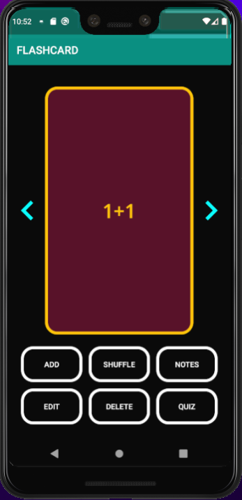

# Flashcard App

Source code for a flashcard app developed by Dominic Bryan

## Live Demo

https://youtu.be/rGWyn9UHRoo

## User Interface

    
    
    
    
    
    
    
    
    
    
    
    
    

## Database Structure (SQL)

|ID | DECK_NAME | QUESTIONS | ANSWERS | ANNOTATIONS |
|-|-|-|-|-|
|**Primary Key**, Integer, Autoincrement | Text | Text | Text | Text |

## Features

<ul>
<li>
    Flip animation to switch between each side of the cards.
</li> 
<li>
Ability to search decks and see recent activities.
</li> 
<li>
Visualization of quiz results using a pie chart.
</li> 
<li>
Move to the next and previous card.
</li> 
<li>
Add as many cards as the user wants.
</li> 
<li>
Edit cards.
</li> 
<li>
Delete the current card.
</li> 
<li>
Shuffle the cards. 
</li> 
<li>
Add annotations to any card.
</li> 
<li>
Add as many decks as the user wants.
</li> 
<li>
Change the name of decks.
</li> 
<li>
Delete decks.
</li> 
<li>
Successful implementation of daily notification
</li> 
<li>
“Quiz” function to test user retention, which involves quiz grading.
</li> 
</ul>